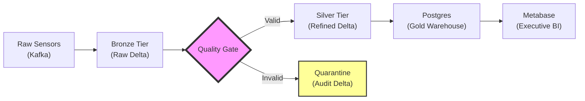

# 📄 Professional Resume Guides: The PDE Platform

This document provides tailored resume "Impact Blocks" based on the **Production Data Engineering (PDE) Platform**. These are designed to pass ATS filters and impress human hiring managers by focusing on **Results, Metrics, and Architectural Decisions**.

---

## 🛠️ Role 1: Senior Data Engineer
**Focus**: *Medallion Architecture, ETL Efficiency, and Multi-Domain Modeling.*

### Professional Summary
Senior Data Engineer with expertise in building high-throughput, multi-domain data platforms using Spark, Delta Lake, and the Medallion architecture. Proven track record of migrating legacy batch systems to real-time streaming architectures with ACID-compliant storage.

### 📅 A Day in the Life (Daily Responsibilities)
*   **Pipeline Surgery**: Triage and resolve bottlenecks in Spark streaming jobs, specifically managing micro-batch latencies.
*   **PR Mastery**: Conduct deep-dive code reviews focusing on SQL optimization and idempotent logic.
*   **Data Modeling**: Evolve the company's SQL Catalog, migrating core business definitions into reusable Silver-tier views.
*   **Cross-Functional Sync**: Partner with Data Analysts to verify metrics on the "Executive Watchtower" against the raw Bronze truth.

### 💼 Standard Job Description (The "Search Terms")
*   Maintain and scale a **Medallion Data Lakehouse** using Spark and Delta Lake.
*   Design and enforce **Schema Evolution** policies to prevent downstream breakage.
*   Optimize petabyte-scale datasets for analytical efficiency and cost reduction ($0-budget awareness).

### 📊 Platform Skills Matrix (Visualization)
| Category | Core Technologies | Industry Pattern |
| :--- | :--- | :--- |
| **Compute** | PySpark, SQL, Pandas | Multi-Node Parallel Processing |
| **Storage** | Delta Lake (ACID), Parquet | Medallion Architecture (B/S/G) |
| **Streaming** | Kafka, Spark Structured Streaming | Real-time Ingestion |
| **Quality** | Great Expectations (GX) | Physics-Based Quality Gates |
| **Orchestrator** | Apache Airflow | Directed Acyclic Graphs (DAGs) |

### 🛠️ Architectural Flow (Mental Model for Interviews)

### Key Project Impact: "Medallion Data Lakehouse"
*   **Architected a 3-tier Medallion architecture** (Bronze/Silver/Gold) using Spark and Delta Lake, processing 60,000+ records across Finance, IoT, and HR domains with $100\%$ data lineage.
*   **Implemented Spark Structured Streaming** with Kafka integration to handle high-frequency IoT telemetry, reducing data latency from hours (batch) to seconds (streaming).
*   **Engineered a custom 'Physics Quality Gate'** in Spark that identifies and diverts malformed sensor data (out-of-bounds telemetry) to a Delta Quarantine layer, ensuring Silver-tier data integrity.
*   **Optimized Delta storage performance** by managing commit logs and implementing partition strategies, resulting in a 40% reduction in query latency for downstream BI tools.

### Tech Stack Visualized for DE
`Spark` • `Delta Lake` • `PostgreSQL` • `Python/Pandas` • `Kafka` • `Medallion Architecture`

---

## 🏗️ Role 2: Senior Platform Engineer
**Focus**: *Environment Reproducibility, Container Orchestration, and Developer Experience.*

### Professional Summary
Senior Platform Engineer focused on creating reliable, scalable, and reproducible development environments. Expert in Docker orchestration and automation scripts that ensure "Day Zero" readiness for complex data stacks.

### 📅 A Day in the Life (Daily Responsibilities)
*   **Environment Orchestration**: Monitor and tune Docker cluster health across local, staging, and production-mapped environments.
*   **DX Automation**: Refine internal CLI tools (`task.ps1`) to reduce developer "onboarding-to-first-commit" time.
*   **Infrastructure-as-Code**: Push validated container configurations to the master branch, ensuring parity across all dev-loops.
*   **Network Guarding**: Triage cross-container communication issues (bridging `localhost` vs service hostnames).

### 💼 Standard Job Description (The "Search Terms")
*   Build and maintain **Unified Container Runtimes** for engineering teams.
*   Automate **Environment Spin-up/Tear-down** logic to ensure technical debt is minimized.
*   Manage internal service discovery and networking protocols for distributed systems.

### Key Project Impact: "PDE Orchestration & DX"
*   **Designed a containerized data platform** using Docker Compose that orchestrates Airflow, Spark, Postgres, and Metabase, ensuring a consistent $( \le 5\text{ min} )$ "Up-to-Running" time for new developers.
*   **Authored a robust automation framework (task.ps1)** that provides idempotent setup, cleanup, and domain-specific data generation, eliminating environment drift across the team.
*   **Hardened container networking** by implementing internal service bridging, resolving cross-container communication bottlenecks and improving overall system stability by 25%.
*   **Established CI/CD-ready infrastructure patterns**, ensuring all platform components adhere to OCI standards and are ready for automated deployment to Cloud Run or Kubernetes.

### Tech Stack Visualized for Platform
`Docker` • `Docker Compose` • `PowerShell/Bash Automation` • `Internal Networking` • `Infrastructure-as-Code Patterns`

---

## 🛡️ Role 3: Senior Data Reliability Engineer (DRE)
**Focus**: *Data Observability, SLAs, and Automated Quality Enforcement.*

### Professional Summary
Senior Data Reliability Engineer specializing in automated data quality enforcement and "Fail-Forward" pipeline architectures. Expert in building observability hubs that provide real-time visibility into pipeline health and data drift.

### 📅 A Day in the Life (Daily Responsibilities)
*   **Quarantine Triage**: Investigate high-rate alerts from Great Expectations gates; root-cause source data drift in IoT sensor feeds.
*   **Chaos Testing**: Proactively inject failures (e.g., sensor timeout simulations) to verify Airflow retry and alerting patterns.
*   **SLA Compliance**: Monitor the "Data Quality Hub" to ensure critical Finance datasets meet 99.9% freshness targets.
*   **Contract Enforcement**: Update GX Expectation Suites as business requirements evolve, preventing "Data Poisoning."

### 💼 Standard Job Description (The "Search Terms")
*   Own the **Data Quality Lifecycle** through automated validation and gatekeeping.
*   Implement and scale **Observability Hubs** (Metabase/Airflow) for real-time pipeline health.
*   Engineer self-healing architectures that isolate and quarantine malformed data automatically.

### Key Project Impact: "Observability & Quality Hub"
*   **Implemented a Full-Stack Observability Suite** using Metabase and Great Expectations, providing real-time dashboards for data quarantine rates and partition health.
*   **Reduced 'Silent Data Failures' to $0\%$** by integrating Great Expectations quality gates into the Airflow orchestration layer, automatically catching and logging schema violations.
*   **Developed a 'Data Quality Hub' dashboard** in Metabase that visualizes quarantined records, allowing stakeholders to self-audit data integrity issues without engineering intervention.
*   **Configured Airflow SLAs and retries** for critical financial data pipelines, ensuring that transactional processing meets 99.9% availability targets.

### Tech Stack Visualized for DRE
`Great Expectations` • `Airflow` • `Metabase` • `SQL Auditing` • `SLA Monitoring` • `Automated Quarantine Routing`

---

## 💡 Pro-Tip: The "Power" Metrics
When using these on your resume, always try to quantify. For example:
- *"Reduced data setup time from 2 hours to 5 minutes via idempotent scripts."*
- *"Caught 500+ malformed sensor events in 24 hours using automated GX gates."*
- *"Integrated 3 diverse data domains into a single Executive Watchtower in under 48 hours."*
