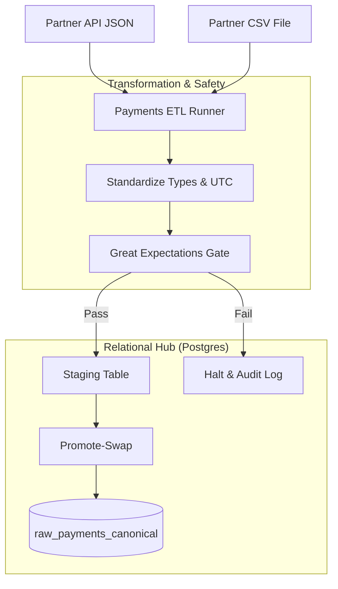

# Demo 1: Fraud-Ready Payments Intake

**Status: ✅ Implemented & Verified**

### 🎯 The Pitch
This demo focuses on **Financial Integrity**. When handling payments, there is **zero room for error**. We demonstrate how to ingest financial data from multiple partners while ensuring the data warehouse only reflects the **most accurate, clean version** of a transaction.

### 🛠️ Technical Challenges
- **Precision Money Handling**: Ensuring currency amounts are cast correctly without float-point errors.
- **Canonical Conflict Resolution**: Implementing **"CSV Wins"** logic via SQL views.
- **Strict Quality Gating**: Using **Great Expectations** to block negative payments and invalid statuses.

### 🎓 Teaching Flow
- **Data Mocking**: Create CSV and JSON files simulating partner API pings.
- **Infrastructure**: Spin up the isolated environment via `docker-compose.payments.yml`.
- **Ingestion**: Run the ETL in Docker to land data into `raw_payments` (Postgres on `5433`).
- **Conflict Test**: Show how the `raw_payments_canonical` view picks CSV over API records.
- **Chaos Run**: Change one transaction amount to **-75.50** and watch the GE gate stop the pipeline.
- **Recovery**: Fix the CSV, rerun, and verify the pipeline succeeds.

### 🏗️ Ingestion Architecture

### 🚀 Infrastructure Isolation (Enterprise Standard)
This demo runs on a dedicated, isolated stack to prevent port and network collisions:
- **Compose Architecture**: `docker-compose.payments.yml`
- **Postgres Port**: `127.0.0.1:5433`
- **Network**: `pde_payments_net`

---
**Links:**
- [**Walkthrough Script**](walkthrough.md)
- [**Learning Guide (Theory & Interview)**](learning_guide.md)
