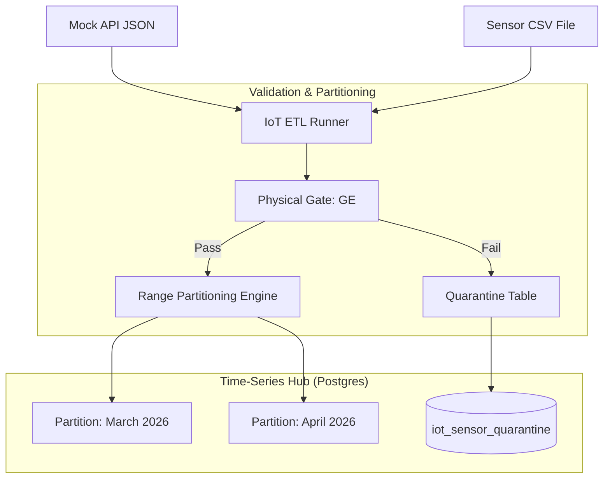

# Demo 2: IoT Sensor Telemetry

**Status: ✅ Implemented & Verified**

### 🎯 The Pitch
This demo shifts focus to **"Material Reality."** We simulate a high-volume IoT environment where thousands of sensors upload data. The challenge is ensuring that **hardware failures** or **sensor drift** don't corrupt analytical models.

### 🛠️ Technical Challenges
- **Time-Series Deduplication**: Handling millions of pings while ensuring uniqueness.
- **Physical Bounds Checking**: Validating metrics against **physical reality** (e.g., rejecting humidity > 100%).
- **Metric-Unit Consistency**: Preventing **"Unit Mismatch"** bugs (e.g., Fahrenheit vs. Celsius).

### 🎓 Teaching Flow
- **High-Volume Mocking**: Generate a CSV containing thousands of readings with **ghost outliers**.
- **Infrastructure**: Spin up the isolated environment via `docker-compose.iot.yml`.
- **Visual Profiling**: Use **JupyterLab** to plot sensor graphs, making faults visually apparent.
- **Physical Gate**: Configure **Great Expectations** to act as a **"physics engine."**
- **Batch Quarantine Pattern**: Watch the pipeline automatically **quarantine** impossible readings into Postgres (Port `5434`).

### 🏗️ Ingestion Architecture

### 🚀 Infrastructure Isolation (Enterprise Standard)
This demo runs on a dedicated, isolated stack to prevent port and network collisions:
- **Compose Architecture**: `docker-compose.iot.yml`
- **Postgres Port**: `127.0.0.1:5434`
- **Network**: `pde_iot_net`

---
**Links:**
- [**Walkthrough Script**](walkthrough.md)
- [**Learning Guide (Theory & Interview)**](learning_guide.md)
