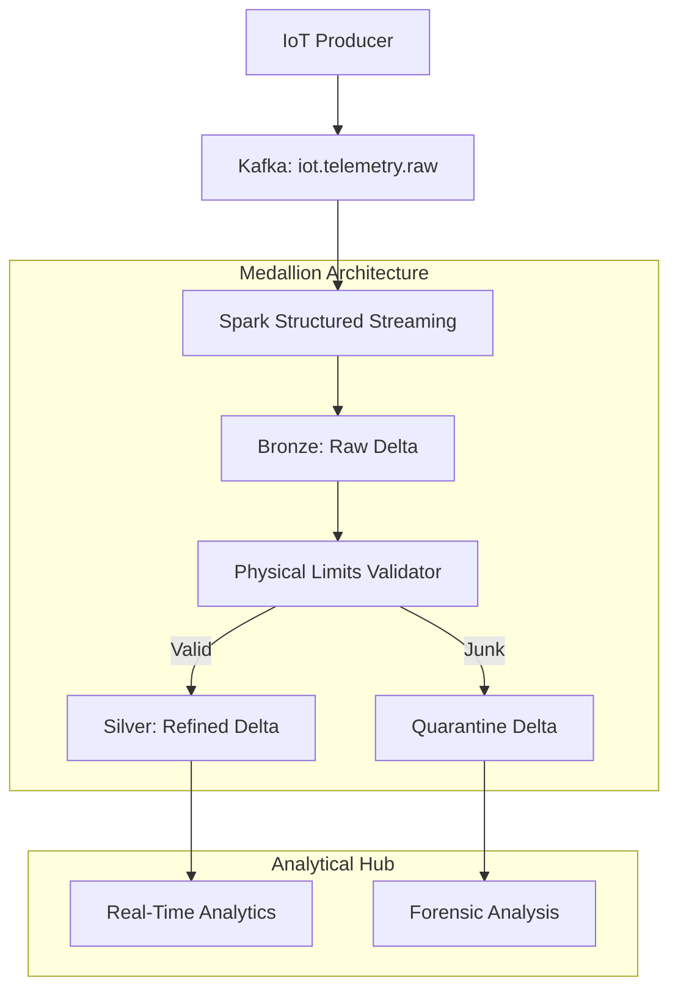

# Demo 4: Streaming Event Platform (Real-Time IoT)

**Status: ✅ Operational / Enterprise Ready**

### 🎯 The Pitch
This demo upgrades the lab from **Batch IoT** to **Real-Time Streaming**. We transition from periodic file drops to a high-velocity event-driven architecture using **Kafka** and **Spark Structured Streaming**. This is the definitive "Senior Data Engineer" demo, showcasing stateful processing and the **Medallion Architecture** (Bronze/Silver/Quarantine).

### 🏗️ Streaming Architecture

### 🛠️ Technical Challenges & "War Stories"
- **Java Runtime Isolation**: Successfully injected an **OpenJDK 17 JRE** into the base Python image to support PySpark.
- **Hostname Protocol**: Standardized on **RFC 1123 compliant hyphens** (e.g., `iot-kafka`) for Java/Scala URI compatibility.
- **Micro-Batch Observability**: Implemented custom `foreachBatch` logic for real-time row-count auditing.
- **ACID Persistence**: Used **Delta Lake** to ensure Exactly-Once processing and historical "Time Travel" audits.

---
**Links:**
- [**Walkthrough Script**](walkthrough.md)
- [**Learning Guide (Theory & Interview)**](learning_guide.md)
