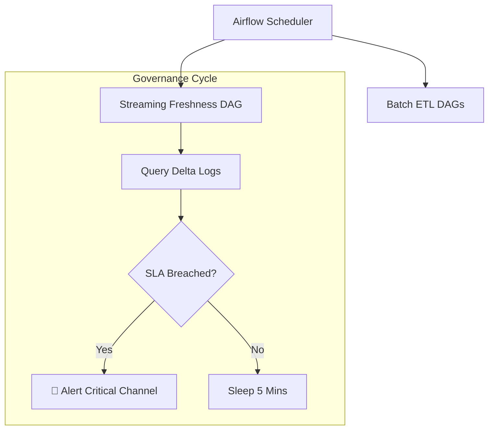

# Demo 5: Platform Orchestration & SLA Governance

**Status: ✅ Implemented & Verified**

### 🎯 The Pitch
This demo moves the platform into **Operational Maturity**. We use **Apache Airflow** to orchestrate batch pipelines and monitor streaming health. The focus is on **SLA (Service Level Agreement)** governance—ensuring that data isn't just processed, but processed *on time*.

### 🏗️ Orchestration Architecture

### 🛠️ Technical Challenges
- **Containerized Integration**: Connecting Airflow workers to isolated demo networks.
- **Transaction Log Auditing**: Querying Delta Lake metadata to determine "last write" timestamps for freshness monitoring.
- **Symmetrical Deployment**: Ensuring DAGs are portable and resilient across containerized environments.

---
**Links:**
- [**Walkthrough Script**](walkthrough.md)
- [**Learning Guide (Theory & Interview)**](learning_guide.md)
