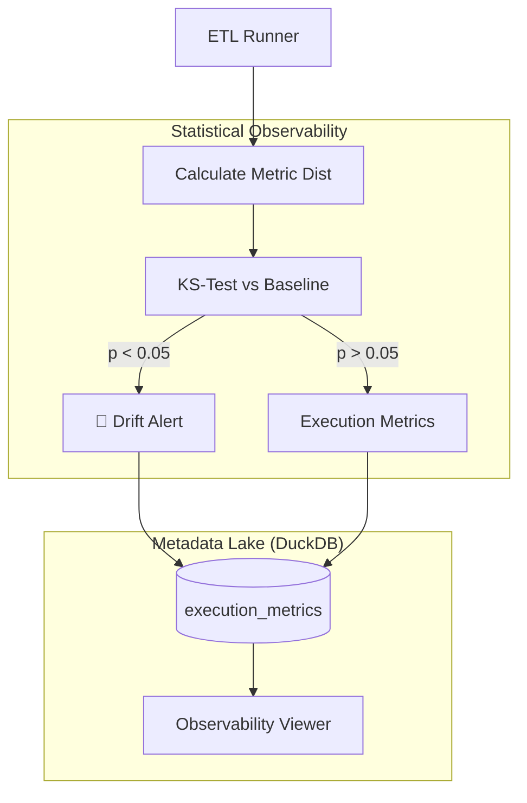

# Demo 6: Proactive Data Observability

**Status: ✅ Implemented & Verified**

### 🎯 The Pitch
This demo transitions the platform from **Reactive Data Quality** (Great Expectations) to **Proactive Data Observability**. We demonstrate how to detect "silent" data shifts—such as statistical drift in financial amounts—that pass traditional schema checks but compromise downstream analytics and ML models.

### 🏗️ Observability Architecture

### 🛠️ Technical Challenges
- **Metric Centralization**: Using a dedicated local **DuckDB** Metadata Lake to decouple observability from source databases.
- **Cross-Cutting Concerns**: Injecting observability hooks into the ETL pipeline without modifying core business logic.
- **Statistical Guardrails**: Implementing the **Kolmogorov-Smirnov (KS) test** to detect distribution shifts in real-time.

---
**Links:**
- [**Walkthrough Script**](walkthrough.md)
- [**Learning Guide (Theory & Interview)**](learning_guide.md)
