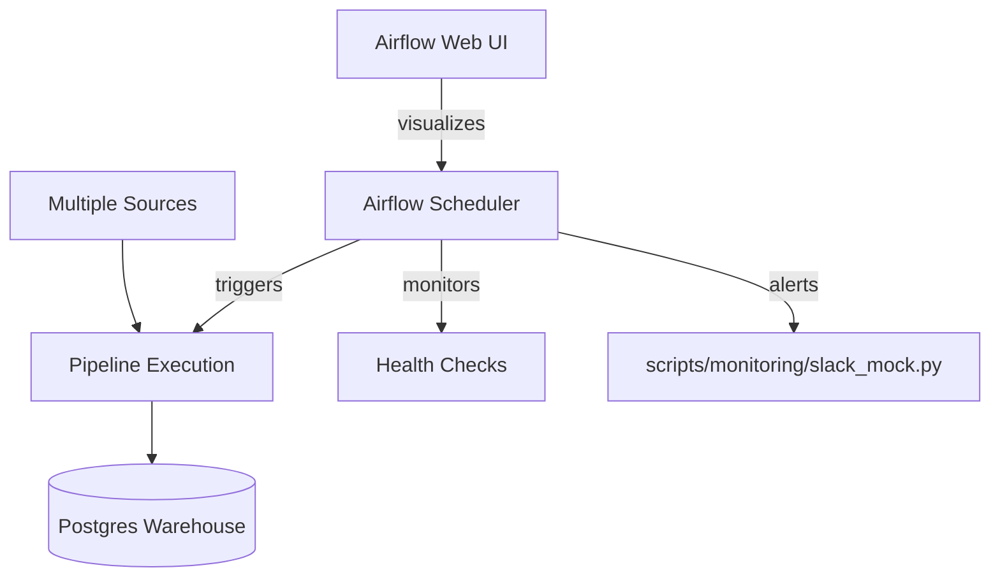

# Demo 4: Enterprise Data Platform (Orchestration & Governance)

Welcome to the final stage of the Data Engineering Lab. Demo 4 transforms your isolated pipelines into a production-grade **Enterprise Data Platform**.

## 🎯 Objective

To demonstrate how large-scale data platforms are operated at scale using **Apache Airflow**. This demo focuses on:
- **Centralized Orchestration**: Scheduling batch and streaming jobs.
- **Operational Monitoring**: Heartbeat checks on real-time pipelines.
- **Automated Governance**: Integrated quality gates and alerting.

## 🏗️ Architecture



## 🚀 Getting Started

Ensure the base Docker infrastructure is up, then start the Orchestration Layer:

```powershell
# Using the Task Runner
.\task.ps1 platform-up
```

### 1. Accessing the Platform
- **Airflow UI**: [http://localhost:8080](http://localhost:8080)
- **Logins**: `admin` / `admin`

### 2. Live Monitoring
The `iot_streaming_monitor` DAG runs every 5 minutes. It verifies:
- **Connectivity**: Can the platform reach the Kafka cluster?
- **SLA Pulse**: Is the `silver` Delta table receiving fresh data?

## 🛠️ Platform Management

Available via `task.ps1`:
- `platform-up`: Start Airflow services.
- `platform-down`: Stop Airflow services.
- `demo-orchestration`: Start the **complete** stack (Warehouse + Streaming + Orchestration).

## 🚨 Alerts & Failures
If a pipeline fails (e.g., due to Great Expectations violations), the platform will:
1. Log the failure in Airflow.
2. Trigger the `notify_failure` callback.
3. Print a high-visibility terminal alert via `slack_mock.py`.
